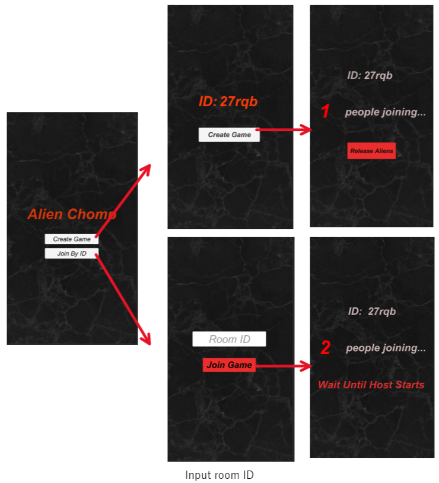

# Alien Chomp

## About our game

### Game Summary

Alien Chomp is a cooperative multiplayer mobile game for Android where players complete objectives while avoiding an alien which is trying to chomp them.

This game uses players' real-life location as their location within the game. Objectives correspond with map coordinates, which players must walk to in order to complete.

However, the alien is constantly stalking players and must be avoided. It is not possible to fight the alien. The only defense is a motion detector, which shows the location of the alien relative to the player.

### Alien Attention

The following actions attract the alien's attention:

- Completing objectives
- Using the motion detector
- Walking quickly (1 m/s or faster)

The alien's attention to a player gradually reduces over time. Standing still and holding one's phone perpendicular to the ground will give a bonus to the reduction.

When the alien is within ~20m of a player, it will close in and chomp the player if that player is attracting the alien's attention over some expent.

However, if the player has a low attraction level, the alien will not be able to pinpoint the player's location and will patrol the area looking for the player. This gives a quiet player a chance to sneak out of the vicinity and throw the alien off.

Running is _not_ allowed in this game. If the game detects that a player is running, the alien will be alerted to his position and will zero in on the player and chomp him.

## Game flow

Below is an illustration of gameplay from creation to game over.

<!--  -->





## Contribution guidelines

### Unity

Download the game engine Unity on [Unity Store](https://store.unity.com/#plans-individual).
Follow the instructions.

Fork and clone this repository to your local computer.

Open Unity Hub, click `ADD` and select the folder of the clone.


The project should appeare bellow.
Select the added project.

### Mapbox

To set up the token for Mapbox, select the `Mapbox` > `setup ` tab in the Unity Editor and paste in your token. Hit `Submit`, and close the popup.

For information on acquiring a token, see [documentation](https://docs.mapbox.com/help/getting-started/access-tokens/).

### Git

#### Feature branches

Any changes must be made on feature branches. `main` is protected and cannot be changed directly.

To merge changes into `main`, open a pull request from a feature branch. At least one review is required before merging.

#### Commit standards

- Include a summary: a short, concise statement summarising your commit. Does not end in a period.
- Include a body: expands on the summary, giving full details on what changed. This can be multiple lines or a bulleted list. Uses correct punctuation and grammar. Not necessary if the summary sufficiently describes the changes.
- Include a footer: references specific issue on Github. Can reference multiple issues. Use verbs "resolves", "fixes", "closes", followed by issue number. Not necessary if the commit does not pertain to an issue hosted on Github.
- A commit consists of changes related to _one_ thing. If your code pertains to several things, break it up into multiple commits.
- Use "WIP" for works in progress.

#### Summary/body/footer structure

- Summary: max 50 characters
- Body: max 72 characters
- Footer: max 72 characters (although you only need ~10)

This is an illustration of character limits:

```
|~summary~~~~~~~~~~~~~~~~~~~~~~~~~~~~~~~~~~~~~~~|

|~body~~~~~~~~~~~~~~~~~~~~~~~~~~~~~~~~~~~~~~~~~~~~~~~~~~~~~~~~~~~~~~~~|

|~footer~~~~~~~~~~~~~~~~~~~~~~~~~~~~~~~~~~~~~~~~~~~~~~~~~~~~~~~~~~~~~~|
```

Here is an example commit:

```
Increase noise from objective completion

Noise generation doubled. Previous noise level was not resulting in a
noticable change in alien behaviour towards player.

resolving #22
```
